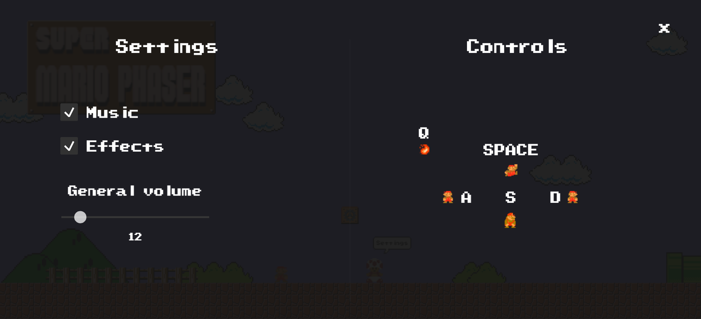

# **Super Vixis Bros**

Super Vixis Bros is a recreation of the classic Super Mario Bros game using the Phaser framework. The goal of this project is to bring the nostalgic experience of playing the iconic platform game to modern web browsers. An interesting feature of this game is the random generation of levels, which ensures that each game offers a unique and challenging experience.

## **Tabla de Contenidos**

- [Demo](#Demo)
- [Controls](#Controls)
- [Contributing](#Contributing)
- [License](#License)

### Demo

A live demo of the game can be accessed at [https://vixito.github.io/Super-Vixis-Bros/](https://vixito.github.io/Super-Vixis-Bros/).

Some screenshots of the game:

### Controls

Controls are fully customizable, however default controls are:

**Jump:** SPACE

**Move Left:** A

**Move Right:** D

**Crouch:** S

**Fire:** Q

### Contributing

Contributions are welcome! If you find any issues or have suggestions for improvements, please open an issue or submit a pull request. This project has been taken from the [@decapapi repository](https://github.com/decapapi/Super-Mario-Phaser).